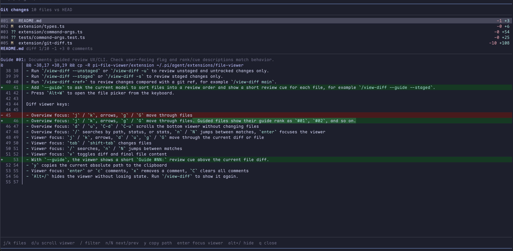

# pi-file-viewer

Interactive file view and review extension for [pi](https://pi.dev).

Open files the agent touched, inspect the diff, leave line comments, and send the review straight back into your prompt.

https://github.com/user-attachments/assets/f4f06bfd-4d6d-4dd4-b758-265c5630076b

## Features

- Quickly inspect files the agent changed without leaving pi.
- Jump between recent edits, search inside files, and understand what changed at a glance.
- Leave line-by-line review notes and send them back to the agent as actionable feedback.

## Installation

Install from GitHub with pi:

```bash
pi install git:github.com/tobias-walle/pi-file-viewer
```

Restart pi or run `/reload` after installing.

You can also just clone the extension and modify it:

```bash
git clone https://github.com/tobias-walle/pi-file-viewer.git
mkdir -p ~/.pi/agent/extensions
cp -R pi-file-viewer/extension ~/.pi/agent/extensions/file-viewer
```


## Usage

- Run `/view-file` to select a file to view. If a file viewer is hidden, `/view-file` shows it again.
- Run `/view-diff` to review everything that would be included by `git add -A`. If a diff viewer is hidden, `/view-diff` shows it again.
- Run `/view-diff --unstaged` or `/view-diff -u` to review unstaged and untracked changes only.
- Run `/view-diff --staged` or `/view-diff -s` to review staged changes only.
- Run `/view-diff <ref>` to review changes compared with a git ref, for example `/view-diff main`.
- Add `--guide` or `-g` to ask the current model to sort files into a review order and show a short review cue for each file, for example `/view-diff -g --staged`.

This extension does not install a global keyboard shortcut. To create your own, add a small personal extension such as `~/.pi/agent/extensions/file-viewer-shortcut.ts`:

```ts
import type { ExtensionAPI } from "@earendil-works/pi-coding-agent"

export default function (pi: ExtensionAPI) {
  pi.registerShortcut("alt+w", {
    description: "Open file viewer",
    handler: () => {
      pi.sendUserMessage("/view-file")
    },
  })
}
```

Run `/reload`, then press `Alt+W` to open the file picker. Change `alt+w` to any shortcut you prefer.



Diff viewer opens with the file content focused.

Diff viewer keys:

- Overview focus: `j` / `k`, arrows, `g` / `G` move through files. Guided files show their guide rank as `#01`, `#02`, and so on.
- Overview focus: `d` / `u`, `C-d` / `C-u` scrolls the bottom viewer without changing files
- Overview focus: `/` searches by path, status, or stats, `n` / `N` jumps between matches, `enter` focuses the viewer
- Viewer focus: `j` / `k`, arrows, `d` / `u`, `g` / `G` move through the current diff or file
- Viewer focus: `tab` / `shift-tab` changes files
- Viewer focus: `/` searches, `n` / `N` jumps between matches
- Viewer focus: `v` toggles diff and final file content
- With `--guide`, the viewer shows a short `Guide #NN:` review cue above the current file diff.
- `y` copies the current absolute path to the clipboard
- Viewer focus: `enter` or `c` comments, `x` removes a comment, `C` clears all comments
- `Alt+/` hides the viewer without losing state. Run `/view-diff` to show it again.
- `Esc` returns from the viewer to the overview, or closes filter/search inputs
- `q` or `Ctrl+C` closes and pastes collected comments

File viewer keys:

- `Alt+/` hides the viewer without losing state. Run `/view-file` to show it again.

- `j` / `k` or arrow keys: move
- `d` / `u`: half page down/up
- `g` / `G`: top/bottom
- `/`: search
- `n` / `N`: next/previous search match
- `y`: copy the absolute path to the clipboard
- `enter` or `c`: add or edit a comment on the selected line
- `x`: remove the selected line comment
- `C`: clear all comments
- `q`, `Esc`, or `Ctrl+C`: close

When you close the viewer, collected comments are pasted into the prompt editor.

## Development

Install dependencies and run all checks with Bun:

```bash
bun install
bun run check
```

Run the smoke tests directly:

```bash
bun test
```

Test interactively without installing:

```bash
bun run dev
```

This runs:

```bash
pi --no-extensions -e .
```
